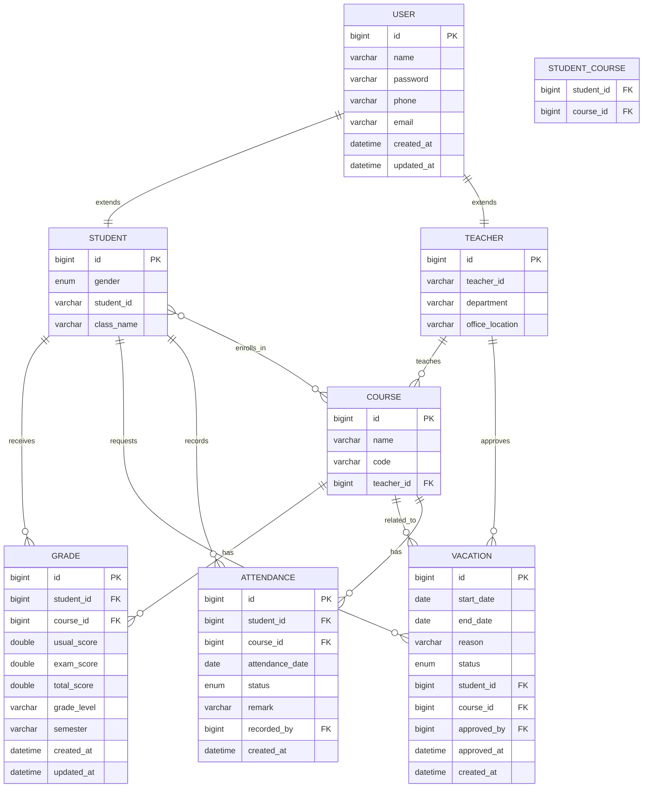

# 学生管理系统数据库设计文档

## 1. ER图（实体关系图）



## 2. 数据流图（DFD）

### 2.1 上下文图（Level 0）


### 2.2 第一层数据流图（Level 1）


## 3. 类图

```mermaid
classDiagram
    class User {
        <<Abstract>>
        -Long id
        -String name
        -String password
        -String phone
        -String email
        -LocalDateTime createdAt
        -LocalDateTime updatedAt
        +onCreate()*
        +onUpdate()*
    }

    class Student {
        -Gender gender
        -String studentId
        -String className
        -Set~Course~ courses
        -List~Vacation~ vacations
        -List~Grade~ grades
        -List~Attendance~ attendances
    }

    class Teacher {
        -String teacherId
        -String department
        -String officeLocation
        -Set~Course~ courses
        -List~Vacation~ approvedVacations
        -List~Attendance~ recordedAttendances
    }

    class Course {
        -Long id
        -String name
        -String code
        -Set~Student~ students
        -Teacher teacher
        -List~Grade~ grades
        -List~Vacation~ vacations
        -List~Attendance~ attendances
    }

    class Vacation {
        -Long id
        -LocalDate startDate
        -LocalDate endDate
        -String reason
        -VacationStatus status
        -Student student
        -Course course
        -Teacher approvedBy
        -LocalDateTime createdAt
        -LocalDateTime approvedAt
        +prePersist()
    }

    class Grade {
        -Long id
        -Student student
        -Course course
        -Double usualScore
        -Double examScore
        -Double totalScore
        -String gradeLevel
        -String semester
        -LocalDateTime createdAt
        -LocalDateTime updatedAt
        +calculateTotalScore()
        +calculateGradeLevel()
    }

    class Attendance {
        -Long id
        -Student student
        -Course course
        -LocalDate attendanceDate
        -AttendanceStatus status
        -String remark
        -Teacher recordedBy
        -LocalDateTime createdAt
    }

    class StudentCourse {
        -Student student
        -Course course
    }

    User <|-- Student
    User <|-- Teacher
    Teacher "1" -- "0..*" Course : teaches
    Course "1" -- "0..*" Student : has_students_via
    Student "1" -- "0..*" Grade : has
    Course "1" -- "0..*" Grade : has
    Student "1" -- "0..*" Vacation : requests
    Course "1" -- "0..*" Vacation : related_to
    Teacher "0..1" -- "0..*" Vacation : approves
    Student "1" -- "0..*" Attendance : has
    Course "1" -- "0..*" Attendance : has
    Teacher "0..1" -- "0..*" Attendance : records
    Student }o--o{ Course : enrolls_in_via
```

## 4. 数据库表结构详情

### 4.1 用户表 (user)
```sql
CREATE TABLE user (
    id BIGINT AUTO_INCREMENT PRIMARY KEY,
    name VARCHAR(50) NOT NULL UNIQUE,
    password VARCHAR(50) NOT NULL,
    phone VARCHAR(50) UNIQUE,
    email VARCHAR(50) UNIQUE,
    created_at DATETIME,
    updated_at DATETIME
);
```

### 4.2 学生表 (student)
```sql
CREATE TABLE student (
    id BIGINT PRIMARY KEY,
    gender ENUM('MALE', 'FEMALE') NOT NULL,
    student_id VARCHAR(10) NOT NULL UNIQUE,
    class_name VARCHAR(50) NOT NULL,
    FOREIGN KEY (id) REFERENCES user(id) ON DELETE CASCADE
);
```

### 4.3 教师表 (teacher)
```sql
CREATE TABLE teacher (
    id BIGINT PRIMARY KEY,
    teacher_id VARCHAR(10) NOT NULL UNIQUE,
    department VARCHAR(50),
    office_location VARCHAR(50),
    FOREIGN KEY (id) REFERENCES user(id) ON DELETE CASCADE
);
```

### 4.4 课程表 (course)
```sql
CREATE TABLE course (
    id BIGINT AUTO_INCREMENT PRIMARY KEY,
    name VARCHAR(100) NOT NULL,
    code VARCHAR(10) UNIQUE,
    teacher_id BIGINT,
    FOREIGN KEY (teacher_id) REFERENCES teacher(id) ON DELETE SET NULL
);
```

### 4.5 学生课程关联表 (student_course)
```sql
CREATE TABLE student_course (
    student_id BIGINT,
    course_id BIGINT,
    PRIMARY KEY (student_id, course_id),
    FOREIGN KEY (student_id) REFERENCES student(id) ON DELETE CASCADE,
    FOREIGN KEY (course_id) REFERENCES course(id) ON DELETE CASCADE
);
```

### 4.6 请假表 (vacation)
```sql
CREATE TABLE vacation (
    id BIGINT AUTO_INCREMENT PRIMARY KEY,
    start_date DATE,
    end_date DATE,
    reason TEXT,
    status ENUM('PENDING', 'APPROVED', 'REJECTED') NOT NULL DEFAULT 'PENDING',
    student_id BIGINT NOT NULL,
    course_id BIGINT NOT NULL,
    approved_by BIGINT,
    approved_at DATETIME,
    created_at DATETIME,
    FOREIGN KEY (student_id) REFERENCES student(id) ON DELETE CASCADE,
    FOREIGN KEY (course_id) REFERENCES course(id) ON DELETE CASCADE,
    FOREIGN KEY (approved_by) REFERENCES teacher(id) ON DELETE SET NULL
);
```

### 4.7 成绩表 (grade)
```sql
CREATE TABLE grade (
    id BIGINT AUTO_INCREMENT PRIMARY KEY,
    student_id BIGINT NOT NULL,
    course_id BIGINT NOT NULL,
    usual_score DOUBLE,
    exam_score DOUBLE,
    total_score DOUBLE,
    grade_level VARCHAR(10),
    semester VARCHAR(50),
    created_at DATETIME,
    updated_at DATETIME,
    FOREIGN KEY (student_id) REFERENCES student(id) ON DELETE CASCADE,
    FOREIGN KEY (course_id) REFERENCES course(id) ON DELETE CASCADE,
    UNIQUE KEY unique_grade (student_id, course_id, semester)
);
```

### 4.8 考勤表 (attendance)
```sql
CREATE TABLE attendance (
    id BIGINT AUTO_INCREMENT PRIMARY KEY,
    student_id BIGINT NOT NULL,
    course_id BIGINT NOT NULL,
    attendance_date DATE NOT NULL,
    status ENUM('PRESENT', 'ABSENT', 'LATE', 'LEAVE', 'EARLY_LEAVE') NOT NULL,
    remark VARCHAR(200),
    recorded_by BIGINT,
    created_at DATETIME,
    FOREIGN KEY (student_id) REFERENCES student(id) ON DELETE CASCADE,
    FOREIGN KEY (course_id) REFERENCES course(id) ON DELETE CASCADE,
    FOREIGN KEY (recorded_by) REFERENCES teacher(id) ON DELETE SET NULL,
    UNIQUE KEY unique_attendance (student_id, course_id, attendance_date)
);
```

## 5. 数据字典

### 5.1 枚举类型定义

**性别 (Gender)**
- MALE: 男
- FEMALE: 女

**请假状态 (VacationStatus)**
- PENDING: 待审批
- APPROVED: 已批准
- REJECTED: 已拒绝

**考勤状态 (AttendanceStatus)**
- PRESENT: 出勤
- ABSENT: 缺勤
- LATE: 迟到
- LEAVE: 请假
- EARLY_LEAVE: 早退

## 6. 索引设计

```sql
-- 用户表索引
CREATE INDEX idx_user_name ON user(name);
CREATE INDEX idx_user_email ON user(email);
CREATE INDEX idx_user_phone ON user(phone);

-- 学生表索引
CREATE INDEX idx_student_student_id ON student(student_id);
CREATE INDEX idx_student_class_name ON student(class_name);

-- 教师表索引
CREATE INDEX idx_teacher_teacher_id ON teacher(teacher_id);
CREATE INDEX idx_teacher_department ON teacher(department);

-- 课程表索引
CREATE INDEX idx_course_code ON course(code);
CREATE INDEX idx_course_teacher_id ON course(teacher_id);

-- 成绩表索引
CREATE INDEX idx_grade_student_id ON grade(student_id);
CREATE INDEX idx_grade_course_id ON grade(course_id);
CREATE INDEX idx_grade_semester ON grade(semester);

-- 请假表索引
CREATE INDEX idx_vacation_student_id ON vacation(student_id);
CREATE INDEX idx_vacation_course_id ON vacation(course_id);
CREATE INDEX idx_vacation_status ON vacation(status);
CREATE INDEX idx_vacation_created_at ON vacation(created_at);

-- 考勤表索引
CREATE INDEX idx_attendance_student_id ON attendance(student_id);
CREATE INDEX idx_attendance_course_id ON attendance(course_id);
CREATE INDEX idx_attendance_date ON attendance(attendance_date);
```

## 7. 关键业务规则

### 7.1 用户管理
- 用户名必须唯一
- 密码存储为明文（实际项目中应加密）
- 学生和教师继承自用户基类

### 7.2 选课系统
- 学生可以选多门课程
- 课程可以有多个学生
- 每门课程必须有一个授课教师

### 7.3 请假系统
- 请假必须关联具体课程
- 请假由课程对应的教师审批
- 请假状态跟踪完整的审批流程

### 7.4 成绩管理
- 成绩由平时成绩和期末成绩计算得出
- 自动计算总成绩和等级
- 支持按学期查询

### 7.5 考勤管理
- 每日考勤记录
- 支持多种考勤状态
- 防止重复记录同一天的考勤